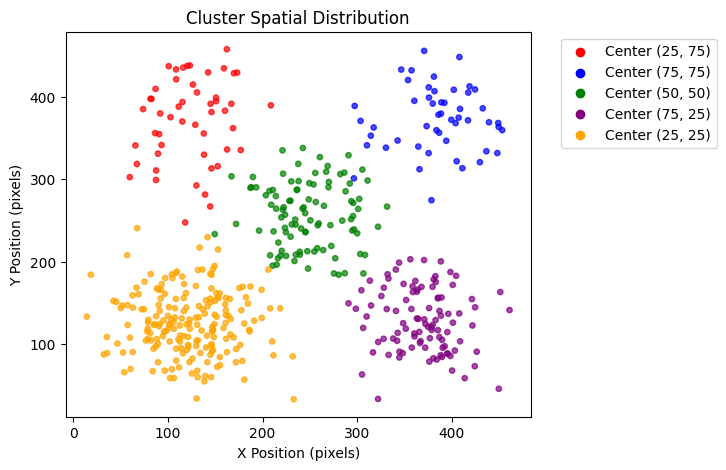
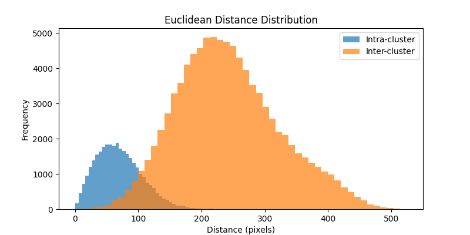
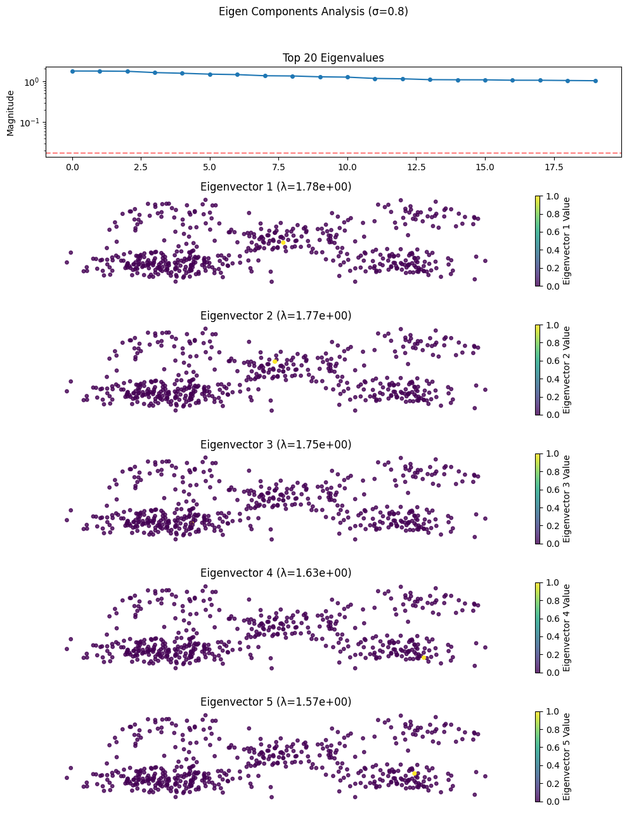
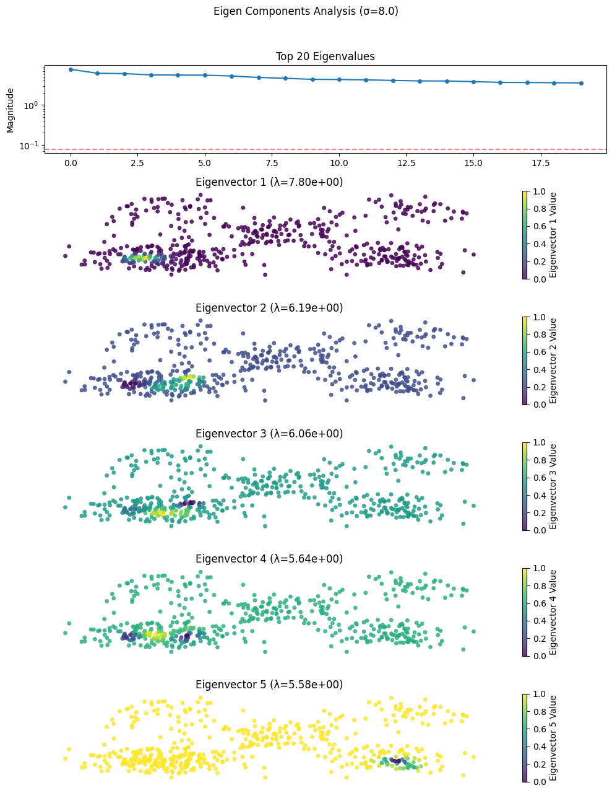
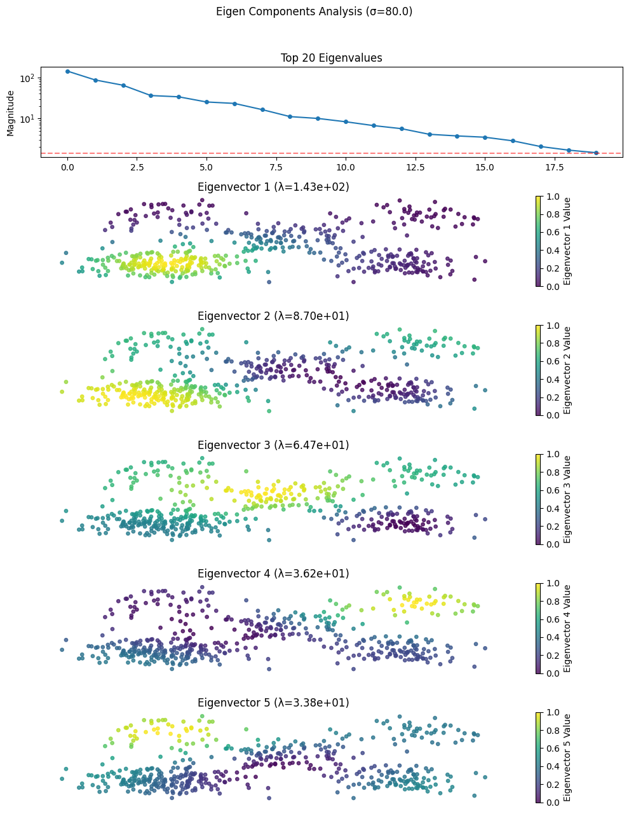
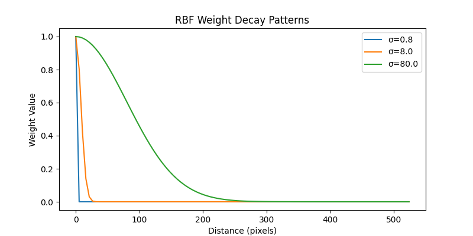
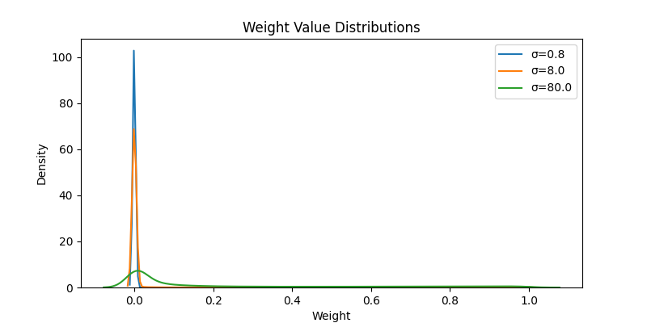
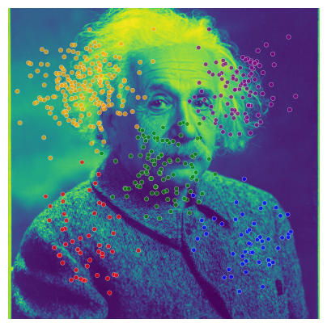
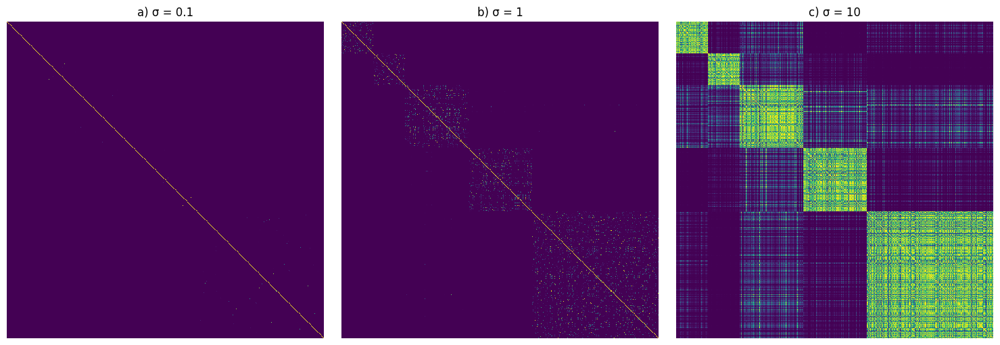
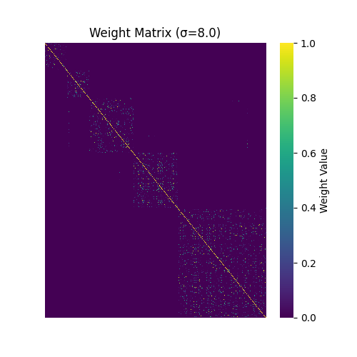

# Spatial Clustering and Eigen Analysis of Synthetic Data on Images

## Overview  
This project generates synthetic spatial data points using Gaussian distributions, clusters them into predefined groups, and performs an eigen analysis on their pairwise distances. The data points are overlaid on an input image, and various visualizations are created to analyze the clustering, distance distributions, weight matrices, and eigen components. The project demonstrates the use of Radial Basis Function (RBF) kernels with different sigma values to model relationships between points and provides insights into their spectral properties.

## Features  
- **Synthetic Data Generation**: Creates 2D points using Gaussian distributions with predefined cluster centers, sizes, and colors.  
- **Distance Matrix**: Computes the Euclidean distance matrix between all pairs of points.  
- **RBF Weight Matrices**: Calculates weight matrices using the RBF kernel for different sigma values.  
- **Visualization**: Generates multiple plots to analyze the data, including:  
  - Points overlaid on an input image.  
  - Spatial distribution of clusters.  
  - Histogram of intra-cluster and inter-cluster distances.  
  - Weight value distributions for different sigma values.  
  - RBF weight decay curves.  
  - Heatmap of the weight matrix.  
  - Eigenvalues and eigenvectors analysis with scatter plots.  

## Technologies Used  
- **Python Libraries**:  
  - `numpy`: For numerical operations, array manipulation, and eigenvalue decomposition.  
  - `matplotlib`: For plotting and visualization.  
  - `seaborn`: For enhanced visualizations like heatmaps and kernel density estimation (KDE) plots.  
  - `scikit-learn`: For computing pairwise Euclidean distances (`euclidean_distances`).  
- **Environment**: Written as a Python script, executable in any Python environment (e.g., Jupyter Notebook, VS Code).  

## How It Works  
1. **Data Generation**:  
   - Generates synthetic 2D points using a Gaussian distribution for five clusters with specified centers, sizes, and colors.  
   - Points are scaled to a 500x500 coordinate system and clipped to stay within bounds.  
2. **Distance and Weight Calculation**:  
   - Computes the Euclidean distance matrix between all pairs of points.  
   - Calculates RBF weight matrices for three different sigma values (`0.1*sigma_d`, `sigma_d`, `10*sigma_d`).  
3. **Visualization**:  
   - **Points on Image**: Overlays the points on the input image (`Einstein.jpg`).  
   - **Cluster Distribution**: Plots the spatial distribution of clusters with a legend.  
   - **Distance Histogram**: Shows the distribution of intra-cluster and inter-cluster distances.  
   - **Weight Distributions**: Plots the kernel density estimation (KDE) of weight values for different sigma values.  
   - **RBF Decay Curves**: Visualizes the decay of RBF weights as a function of distance.  
   - **Weight Matrix Heatmap**: Displays the weight matrix for the default sigma value as a heatmap.  
   - **Eigen Analysis**: Computes and visualizes the top eigenvalues and corresponding eigenvectors of the weight matrices, with scatter plots showing eigenvector values.  

## Results 
  
   
   
   
   


- The project generates synthetic data with 5 clusters, each with a distinct color and center.  
- Visualizations provide insights into:  
  - Spatial arrangement of clusters on the image and in a scatter plot.  
  - Differences between intra-cluster and inter-cluster distances.  
  - Behavior of RBF weights across different sigma values.  
  - Spectral properties of the weight matrices through eigenvalue and eigenvector analysis.  
- All plots are saved as PNG files in the specified output directory (default is the current directory).  

## Usage  
1. **Requirements**: Install the required libraries (`numpy`, `matplotlib`, `seaborn`, `scikit-learn`).  
   ```bash
   pip install numpy matplotlib seaborn scikit-learn

2. **Input**: Ensure the input image (Einstein.jpg) is in the same directory as the script, or update the input_image_path variable with the correct path.
3. **Run the Script**: Execute the Python script to generate the data, perform the analysis, and save the visualizations.
4. Output: The script generates the following plots in the specified output_dir:
- points_on_image.png: Points overlaid on the input image.
- cluster_distribution.png: Spatial distribution of clusters.
- distance_histogram.png: Histogram of intra- and inter-cluster distances.
- weight_distributions.png: KDE plot of weight values for different sigma values.
- rbf_curves.png: RBF weight decay curves.
- weight_matrix_heatmap.png: Heatmap of the weight matrix for the default sigma.
- eigen_components_sigma_X.X.png: Eigenvalue plot and eigenvector scatter plots for each sigma value.

## Example Output
- The script successfully generates synthetic data with 400 points across 5 clusters.
- Visualizations highlight the clustering structure, distance distributions, and spectral properties of the weight matrices.
- The eigen analysis dynamically selects the top eigenvalues above a threshold (1% of the largest eigenvalue) and visualizes up to 5 corresponding eigenvectors.

## Future Improvements
- Add support for loading different types of input images or synthetic data configurations.
- Allow users to specify the number of clusters, sigma values, or other parameters via command-line arguments.
- Implement additional distance metrics (e.g., Manhattan, cosine) for comparison.
- Include clustering evaluation metrics (e.g., silhouette score) to quantify the quality of the synthetic clusters.
- Add interactive visualizations using libraries like Plotly for better exploration of the data.

## How to Contribute
1. Fork the repository on GitHub.
2. Clone the forked repository to your local machine.
3. Create a new branch for your changes.
4. Make your modifications or improvements.
5.Test your changes to ensure they work as expected.
6. Commit and push your changes to your forked repository.
7. Create a pull request to the main repository for review.

## License
This project is licensed under the MIT License. Feel free to use, modify, and distribute the code as per the license terms.
